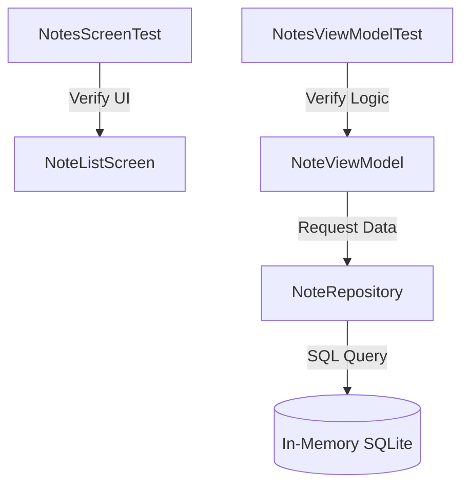

# Notes App - Testing dan Dependency Injection
**Nama:** Muhammad Nurikhsan
**NIM:** 123140057
**Program Studi:** Teknik Informatika
**Kelas:** Pengembangan Aplikasi Mobile RB

---

## Deskripsi
Project ini merupakan tahap finalisasi dari rangkaian tugas pengembangan aplikasi Notes, dengan fokus utama pada implementasi **Dependency Injection (DI)** menggunakan Koin dan **Automated Testing** (Unit Test & UI Test). Implementasi ini memastikan aplikasi memiliki arsitektur yang solid, mudah dipelihara (*maintainable*), dan bebas dari bug fungsional.

Fokus pengembangan pada Tugas 10 meliputi:
- Refactoring arsitektur menggunakan **Koin Dependency Injection**.
- Implementasi **Unit Testing** untuk Business Logic (ViewModel & Repository).
- Implementasi **UI Testing (Instrumented Test)** untuk memvalidasi interaksi pengguna pada Jetpack Compose.
- Penggunaan **Turbine** untuk pengujian asinkronus pada Kotlin Flow.
- Penggunaan **In-Memory Database** untuk isolasi data saat pengujian.

---

## Teknologi & Library Testing
| Library | Kegunaan |
|---|---|
| **Koin** | Dependency Injection framework untuk manajemen instance object. |
| **JUnit 4** | Framework dasar untuk menjalankan unit test. |
| **Kotlinx Coroutines Test** | Library untuk menguji kode yang menggunakan Coroutines (`runTest`, `UnconfinedTestDispatcher`). |
| **Turbine** | Library khusus untuk menguji aliran data pada `Flow` atau `StateFlow`. |
| **Compose UI Test** | Tool untuk melakukan pengujian UI pada Jetpack Compose (`createComposeRule`). |
| **SQLDelight JDBC Driver** | Digunakan untuk menjalankan database SQLite versi In-Memory saat testing. |

---

## Detail Implementasi

### 1. Dependency Injection (Koin)
Aplikasi kini menggunakan Koin untuk mengelola siklus hidup objek. Objek seperti `GeminiService`, `NoteRepository`, dan semua `ViewModel` tidak lagi diinstansiasi secara manual, melainkan di-*inject* melalui modul:
- `dataModule`: Mengelola singleton untuk Database, Driver, dan Service.
- `viewModelModule`: Mengelola factory untuk ViewModel (instance baru dibuat saat dibutuhkan).

### 2. Unit Testing (ViewModel & Repository)
Terletak di folder `androidUnitTest`. Pengujian dilakukan terhadap `NotesViewModel` untuk memastikan logika bisnis berjalan benar:
- **State Validation:** Memastikan UI State berubah dari `Loading` ke `Empty` atau `Content` dengan benar.
- **CRUD Logic:** Memastikan penambahan, penghapusan, dan pencarian catatan menghasilkan output data yang sesuai.
- **Reactive Stream:** Menggunakan **Turbine** untuk memverifikasi setiap emisi data pada `StateFlow` saat terjadi perubahan di database.

### 3. UI Testing (Instrumented Test)
Terletak di folder `androidInstrumentedTest`. Pengujian dilakukan pada `NoteListScreen` menggunakan `ComposeTestRule`:
- **Visual Validation:** Memastikan komponen seperti Empty State muncul saat tidak ada data.
- **Interaction Test:** Menyimulasikan user mengetik di Search Bar dan menekan tombol Delete, lalu memverifikasi perubahan UI secara otomatis.
- **Test Tags:** Menggunakan `TestTags.kt` untuk memastikan identifikasi komponen UI yang akurat dan stabil.

---

## Arsitektur Pengujian


---

## Struktur Project (Fokus Testing & DI)
```
Tugas10_PAM/
└── composeApp/src/
    ├── androidUnitTest/kotlin/com/muhammadnurikhsan/tugas10_pam/
    │   ├── NotesViewModelTest.kt      # Unit Test untuk ViewModel logic
    │   └── NoteRepositoryTest.kt     # Unit Test untuk Repository logic
    ├── androidInstrumentedTest/kotlin/com/muhammadnurikhsan/tugas10_pam/
    │   ├── NotesScreenTest.kt         # UI/Integration Test untuk Compose
    │   └── FakeNoteViewModel.kt       # Mock ViewModel untuk UI Testing
    └── commonMain/kotlin/com/muhammadnurikhsan/tugas10_pam/
        ├── di/
        │   └── AppModule.kt           # Konfigurasi Koin Modules
        └── util/
            └── TestTags.kt            # Konstanta tag untuk UI Testing
```

---

## Cara Menjalankan Test

### 1. Menjalankan Unit Test
Gunakan terminal atau tab "Run" di Android Studio:
```
./gradlew test
```
### Hasil Unit Test


### 2. Menjalankan UI Test
Pastikan emulator atau perangkat fisik terhubung:
```
./gradlew connectedAndroidTest
```
